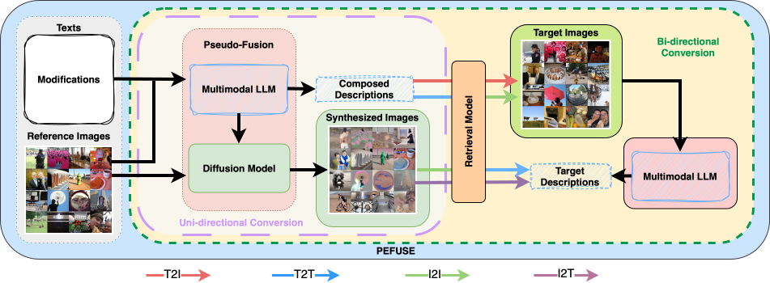

# PEFUSE: Training-Free Pseudo-Fusion for Composed Image Retrieval with Diffusion Models and Multimodal Large Language Models

This repository contains the implementation of **PEFUSE**, a framework designed for **composed image retrieval** (CIR).  
CIR is the task of retrieving target images from a large database given a **query image** and a **compositional modification** (e.g., textual description, attributes, or edits).

---

## Proposed Framework

The overall architecture of PEFUSE is illustrated below:



---


## Citation

If you use this work, please cite:

```bibtex
@article{xu2026trainingfree,
  title   = {Training-Free Pseudo-Fusion for Composed Image Retrieval with Diffusion Models and Multimodal Large Language Models},
  author  = {Fan Xu and Luis A. Leiva},
  journal = {Transactions on Machine Learning Research},
  issn    = {2835-8856},
  year    = {2026},
  url     = {https://openreview.net/forum?id=6W3pFEQXZc}
}